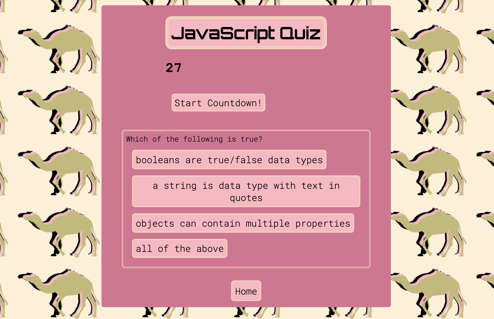
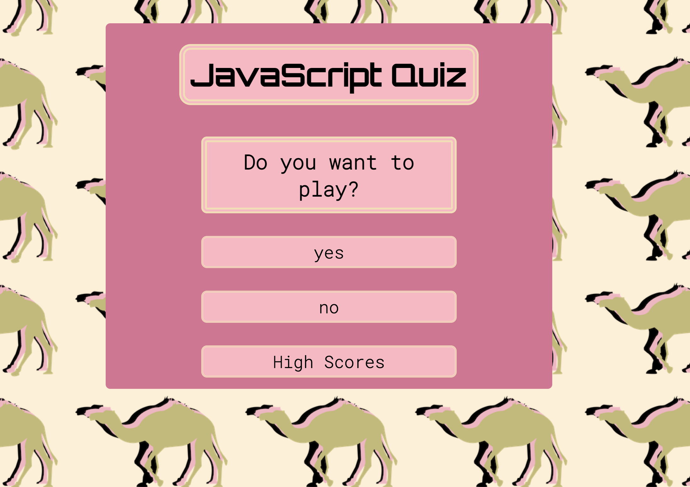
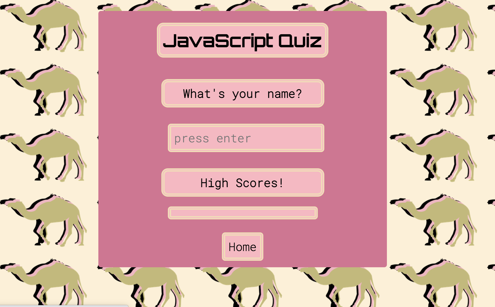

# jillsJavaScriptQuiz
## Here is what I did 

- What was your motivation? 
I enjoy the projects we get to create from scratch because the design work is my biggest motivator. For this project I created all the graphics myself and enjoyed using colors, borders and font choices to make this quiz look a bit like a "retro" arcade game with elements of modern design. I know this focus was on on JavaScript so I made sure to do my best at that as well. This project put to use and combined everything we learned last week about WebAPIS. We had to use a lot of what we just learned about JavaScript to complete this and use new features like local storage, timers, and forms submissions. 

- Why did you build this project? 
To further my understanding and test my knowledge of what we have learned about Javascript. 

- What problem does it solve?
We have learned how to make objects interact with each other and the importance of local storage and how much it is used in the web today.  

- What did you learn? 
This project was a test of everything we have learned so far. I had to do lots of research and trail and error testing to make sure I was doing it write. I used console.log a lot to check what I was doing and realized the importance of doing that in this stage of the game. I also learned that there are truly millions of ways to do this. I know the way I did it probably wasn't th "cleanest" or most efficient way but I understood what I was coding. I may not have met every criteria but I still feel good about what I have accomplished in this short amount of time. 

## Here is a preview of my work:

## Here is a link to my work:
[See it here](https://jilliankayworks.github.io/jillsJavaScriptQuiz/)

## Table of Contents 
- [Installation](#installation)
- [Usage](#usage)
- [Credits](#credits)
- [License](#license)
## Installation
Nothing to install
## Usage
Take a quiz about JS
## Credits
DU Bootcamp 
## License
MIT 

